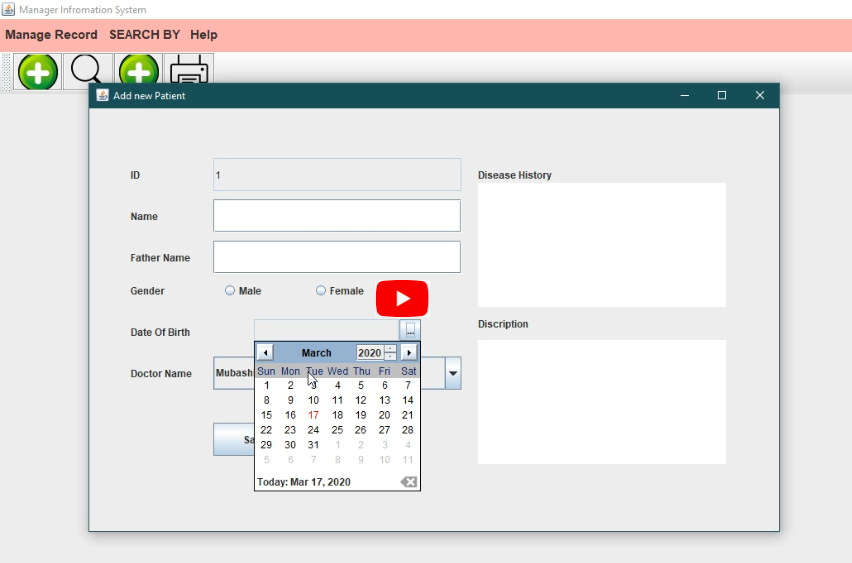
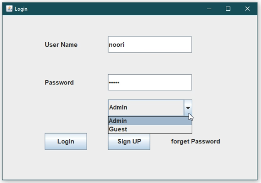
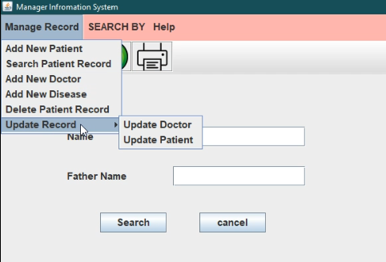
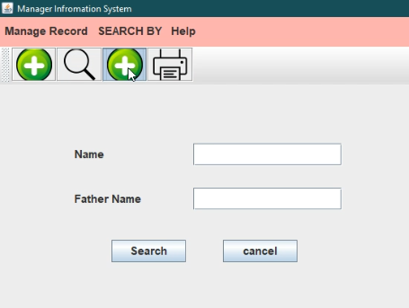
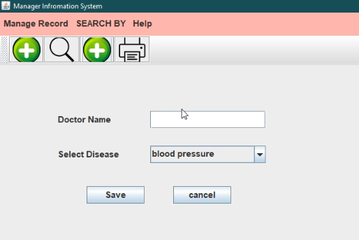
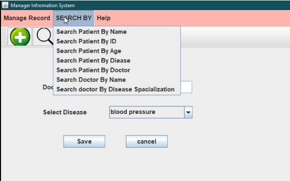
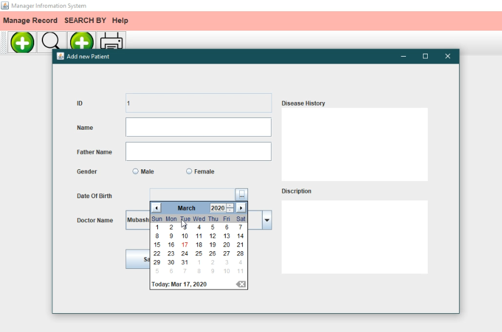

# Patient-Managment-System-in-java-Swing

This project is Developed in pure java language and java Swing technologies. 
Front-end developed in java swing and back-end debveloped in java lnguage. And mySQL database is used to store data.

<h3>Features</h3>
<ul>
<li>Multipal Users of system (Admin, Guest, computer operator etc).</li>
<li>admin can Manage Doctor records. </li>
<li>computer operator can manage Patient and disease records.</li></ul>

<h4>CLick play button to view demo video<h4/>
  
  
  

<h3>Screen shorts</h3>
  
  Login
  

 
 Manage Record Menu
 
 
 
 Search Patient.
 
 
 
 Search Doctor
 
 
 
 Search Menu
 
 

Add Patient

Insert Doctor

