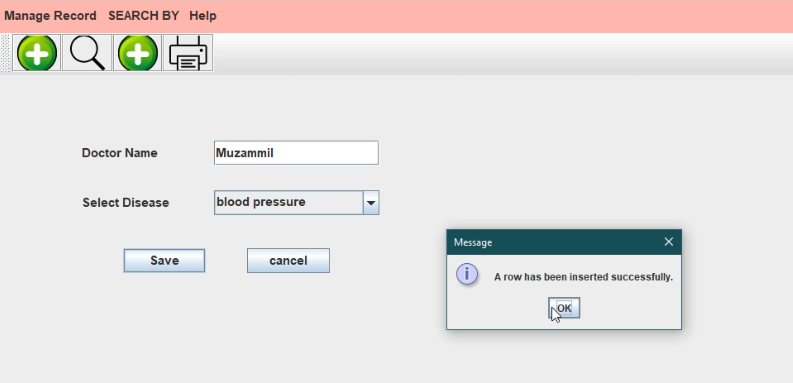

# Patient-Managment-System-in-java-Swing

This project is Developed in pure java language and java Swing technologies. 
Front-end developed in java swing and back-end debveloped in java lnguage. And mySQL database is used to store data.

<h3>Features</h3>

Multipal Users of system (Admin, Guest, computer operator etc).
admin can Manage Doctor records. 
computer operator can manage Patient and disease records.

<h4>View Demo video<h4/>
<iframe width="560" height="315" src="https://www.youtube.com/embed/J-ZZ-9TvuqE"></iframe>
<h3>Screen shorts</h3>
  Login

 
 Manage Record Menu
 
 
 
 Search Patient.
 
 
 
 Search Doctor
 
 
 
 Search Menu
 
 

Add Patient

Insert Doctor

